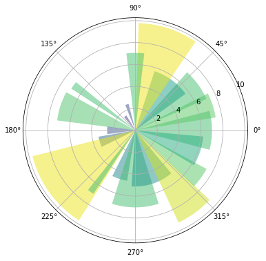

```python
import numpy as np
import matplotlib.pyplot as plt
%matplotlib inline
plt.rcParams['figure.figsize'] = (10,6)

# Fixing random state for reproducibility
np.random.seed(19680801)

# Compute pie slices
N = 20
θ = np.linspace(0.0, 2 * np.pi, N, endpoint=False)
radii = 10 * np.random.rand(N)
width = np.pi / 4 * np.random.rand(N)
colors = plt.cm.viridis(radii / 10.)

ax = plt.subplot(111, projection='polar')
ax.bar(θ, radii, width=width, bottom=0.0, color=colors, alpha=0.5)

plt.show()
```


    

    


```python

```
